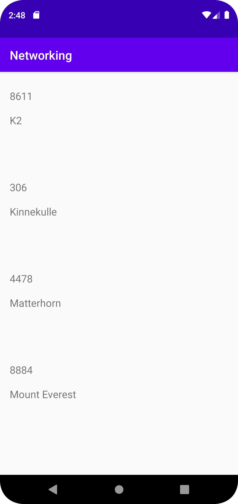

# Rapport

Denna uppgift har krävt skapande av en recyclerview, viewholder och en adapter. Uppgiften har byggt mycket på samspelet mellan olika parter för att nå det önskade resultatet. En URL har även lagts till för att kunna dra information och sedan visa upp den.

En textView har skapats för varje list item. Nedan kan ett exempel hittas på en textView som skapats:

```
    <TextView
        android:id="@+id/mountainName"
        android:layout_width="wrap_content"
        android:layout_height="wrap_content"
        android:layout_marginStart="16dp"
        android:layout_marginTop="68dp"
        android:text="The name of the Mountain"
        android:textSize="17dp"
        app:layout_constraintStart_toStartOf="parent"
        app:layout_constraintTop_toTopOf="parent" />

```

Nedan kan vi även se ett exempel på hur jag har lagt till array för att sedan kunna dra information:

```

@Override
    public void onPostExecute(String json) {
        Log.d("MainActivity", json);
        Gson gson = new Gson();
        Type type = new TypeToken<ArrayList<Mountain>>() {}.getType();
        mountainsList = gson.fromJson(json, type);
        adapter.fetchMountain(mountainsList);
        adapter.notifyDataSetChanged();
    }

``` 

Bild på resultatet kan bli funnen nedan:


